# gym_dog — 自研四足机器人强化学习训练、Sim2Sim 与真机部署

> 面向自研 12 自由度四足机器人的强化学习运动控制仓库。项目以 **Isaac Gym / Legged Gym / PPO** 为训练主线，通过 **ONNX + MuJoCo** 做跨引擎 Sim2Sim 验证，并部署到 **Jetson Orin NX + ROS2 + STM32 + CAN + RobStride RS01** 真机平台。
>
> 当前仓库重点解决：**全向运动、步态稳定、偏航/横漂、力矩约束、策略关节映射以及 Sim2Real 一致性**。自然语言、视觉/雷达语义地图与自主导航属于下一阶段智能控制方向，尚未作为“已完成能力”进行标注。

<p align="center">
  
  
  
  
  
  
</p>

---

## 目录

- [1. 项目简介](#1-项目简介)
- [2. 项目展示](#2-项目展示)
- [3. 当前研发状态](#3-当前研发状态)
- [4. 系统总体架构](#4-系统总体架构)
- [5. 强化学习与部署链路](#5-强化学习与部署链路)
- [6. 当前选定策略模型](#6-当前选定策略模型)
- [7. 仓库结构](#7-仓库结构)
- [8. 环境配置](#8-环境配置)
- [9. 快速开始](#9-快速开始)
- [10. MuJoCo Sim2Sim](#10-mujoco-sim2sim)
- [11. ONNX 与 Deployment Contract](#11-onnx-与-deployment-contract)
- [12. 真机部署](#12-真机部署)
- [13. Sim2Real 关键问题](#13-sim2real-关键问题)
- [14. 项目视频](#14-项目视频)
- [15. 下一阶段路线](#15-下一阶段路线)
- [16. 相关仓库与致谢](#16-相关仓库与致谢)

---

## 1. 项目简介

`gym_dog` 是围绕一套自研四足机器人持续开发的强化学习运动控制仓库。

项目并不是只在仿真环境中训练策略，而是按照下面的完整闭环推进：

```text
机械结构 / URDF
        ↓
Isaac Gym 强化学习训练
        ↓
策略筛选与 Gym Play
        ↓
ONNX 导出 + Deployment Contract
        ↓
MuJoCo Sim2Sim
        ↓
Jetson Orin NX / ROS2
        ↓
SPI → STM32 → CAN → 12×RS01
        ↓
真实电机与 IMU / 关节状态反馈
        ↓
Sim2Real 问题定位与继续训练
```

当前实物平台采用 12 个 RobStride RS01 一体化关节电机，Jetson Orin NX 负责策略推理与上层控制，两块 STM32 负责实时通信与电机控制。

项目来源于国家级大学生创新创业训练计划项目：

- **项目名称**：基于大模型的 ROS 四足机器人开发
- **项目编号**：202513906004
- **当前仓库重点**：强化学习运动控制、Sim2Sim、Sim2Real、真机部署
- **底层通信相关仓库**：https://github.com/jujjjk/zhenji_dog

---

## 2. 项目展示

### 2.1 两代实物样机与 12 电机联调

<table>
<tr>
<td align="center" width="33%">
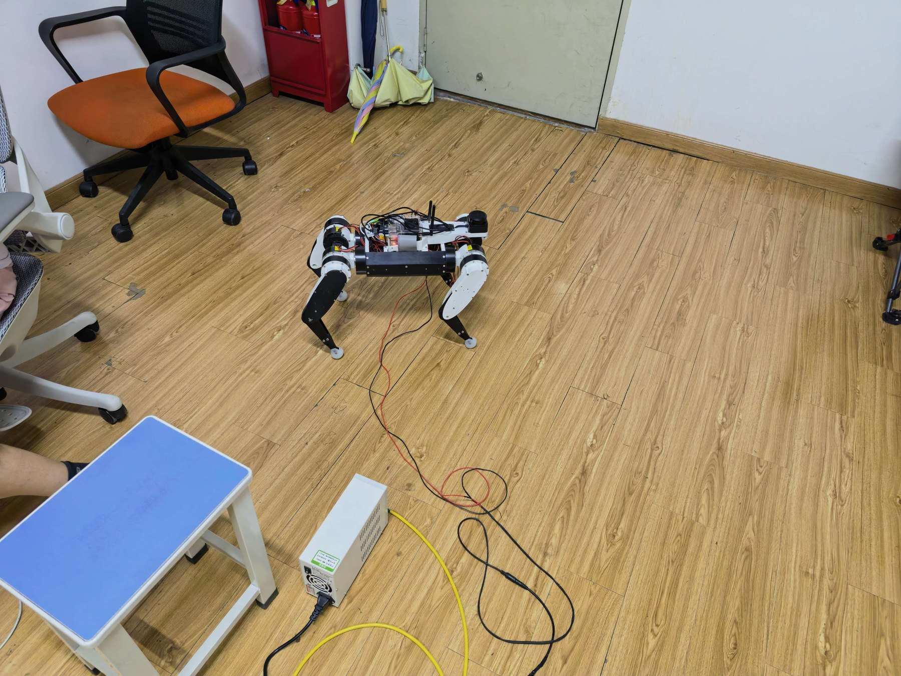<br/>
<b>第一版实物样机</b>
</td>
<td align="center" width="33%">
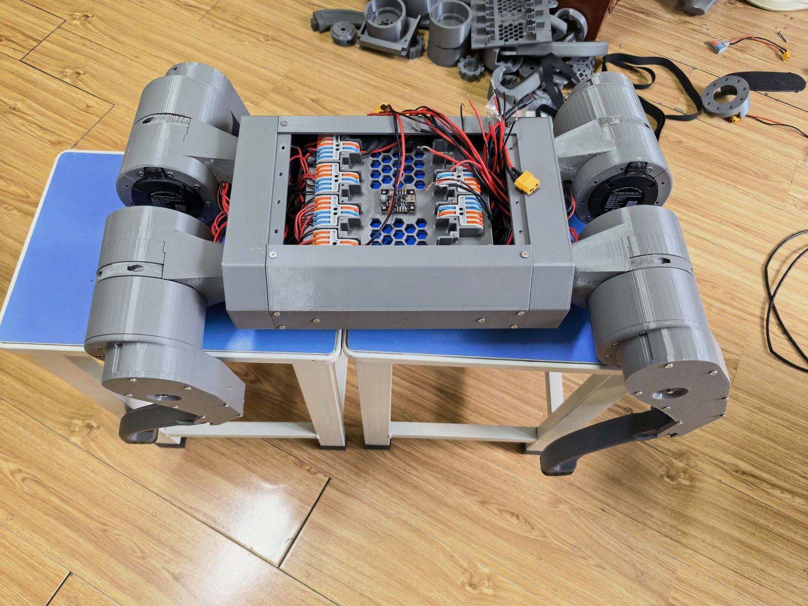<br/>
<b>第二版实物样机</b>
</td>
<td align="center" width="33%">
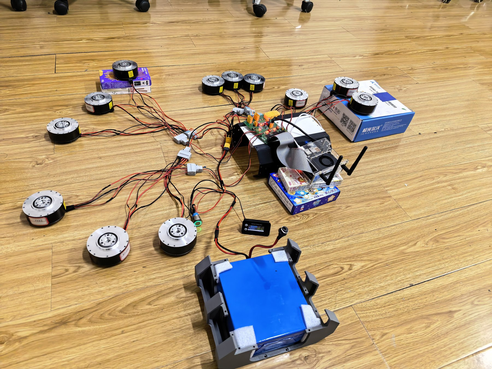<br/>
<b>12×RS01 联合测试</b>
</td>
</tr>
</table>

目前已完成两代实物样机、两版数字模型以及 12 电机联合控制测试。第二版样机是当前强化学习真机部署和 Sim2Real 调试的主要平台。

### 2.2 当前控制链

<p align="center">
  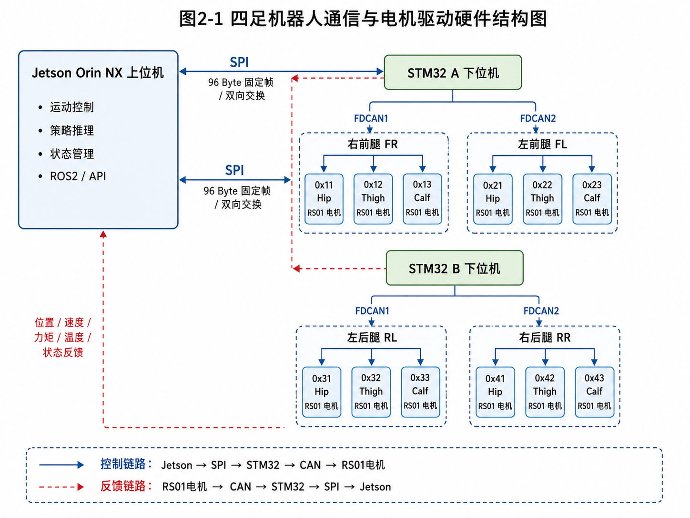
</p>

控制链路：

```text
控制命令：Jetson Orin NX → SPI → STM32 A/B → CAN → RS01
状态反馈：RS01 → CAN → STM32 A/B → SPI → Jetson Orin NX
```

### 2.3 雷达 / ROS2 前期测试

<p align="center">
  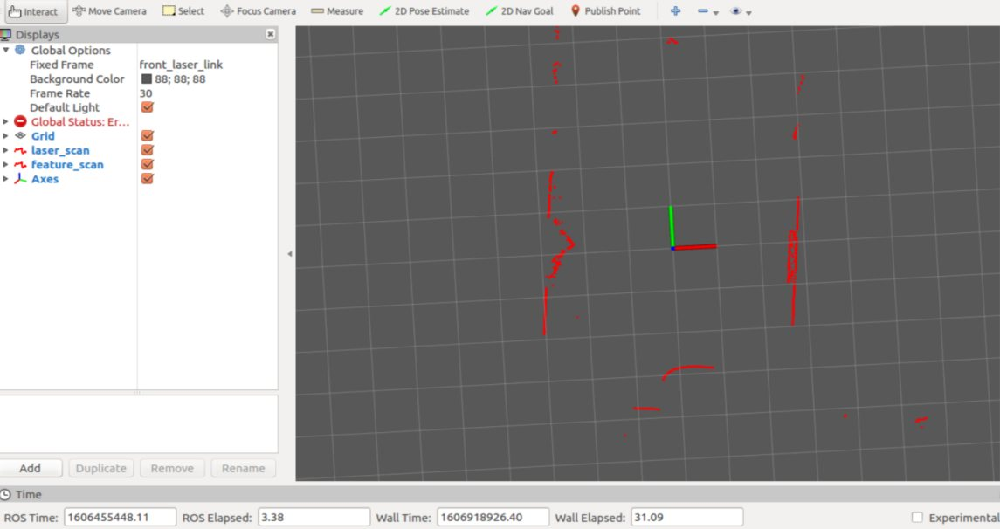
</p>

激光雷达、相机和语音交互属于项目后续智能控制方向的感知基础。当前仓库的核心仍然是运动控制与真机部署。

---

## 3. 当前研发状态

| 状态 | 内容 |
|---|---|
| ✅ 已完成 | 两代四足机器人实物样机 |
| ✅ 已完成 | 第一版 / 第二版 URDF 与关节模型 |
| ✅ 已完成 | Jetson → SPI → 双 STM32 → 4 路 CAN → 12×RS01 执行链 |
| ✅ 已完成 | Isaac Gym / Legged Gym / PPO 训练框架 |
| ✅ 已完成 | checkpoint → ONNX → MuJoCo Sim2Sim |
| ✅ 已完成 | Jetson Orin NX 真机策略推理与约 50 Hz 控制闭环 |
| ✅ 已完成 | 关节语义顺序、真实电机顺序、方向与零位的部署校核流程 |
| 🔧 持续优化 | 直行偏航、横漂、步态对称性、接触时序与力矩饱和 |
| 🔧 持续优化 | 动力学参数、执行器差异、IMU/状态估计与 Sim2Real 一致性 |
| 🧭 下一阶段 | RS03 高扭矩新机型与 48 V 执行系统 |
| 🧭 下一阶段 | 语音 / 大模型 TaskSpec / RGB+LiDAR 语义地图 / Nav2 / RL 智控闭环 |

> **说明**：README 中将“已完成”和“规划中”严格分开。智能控制系统是后续研发方向，不代表当前仓库已经完成自然语言自主导航。

---

## 4. 系统总体架构

### 4.1 训练、验证、部署

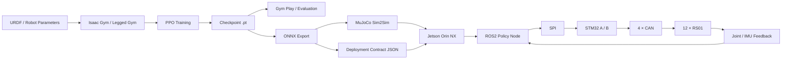

仓库中也保留了对应的工程路线图：

<p align="center">
  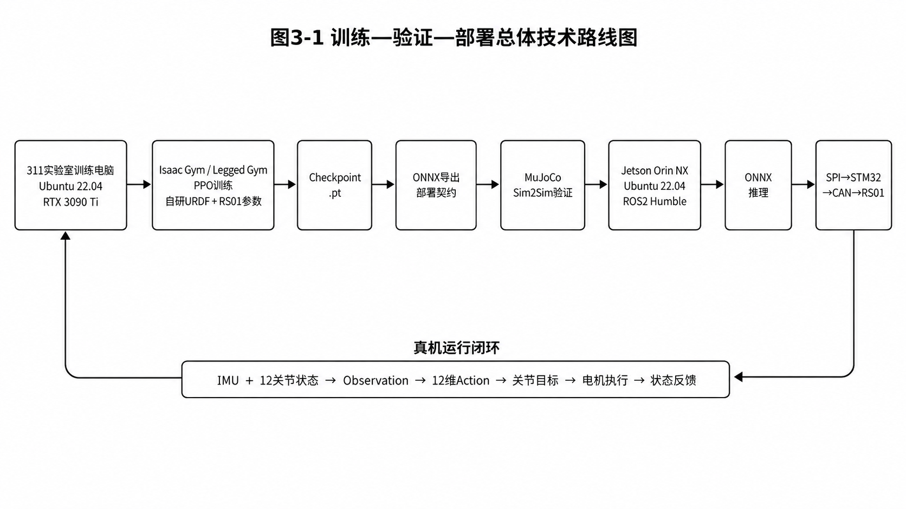
</p>

### 4.2 真机实时分层

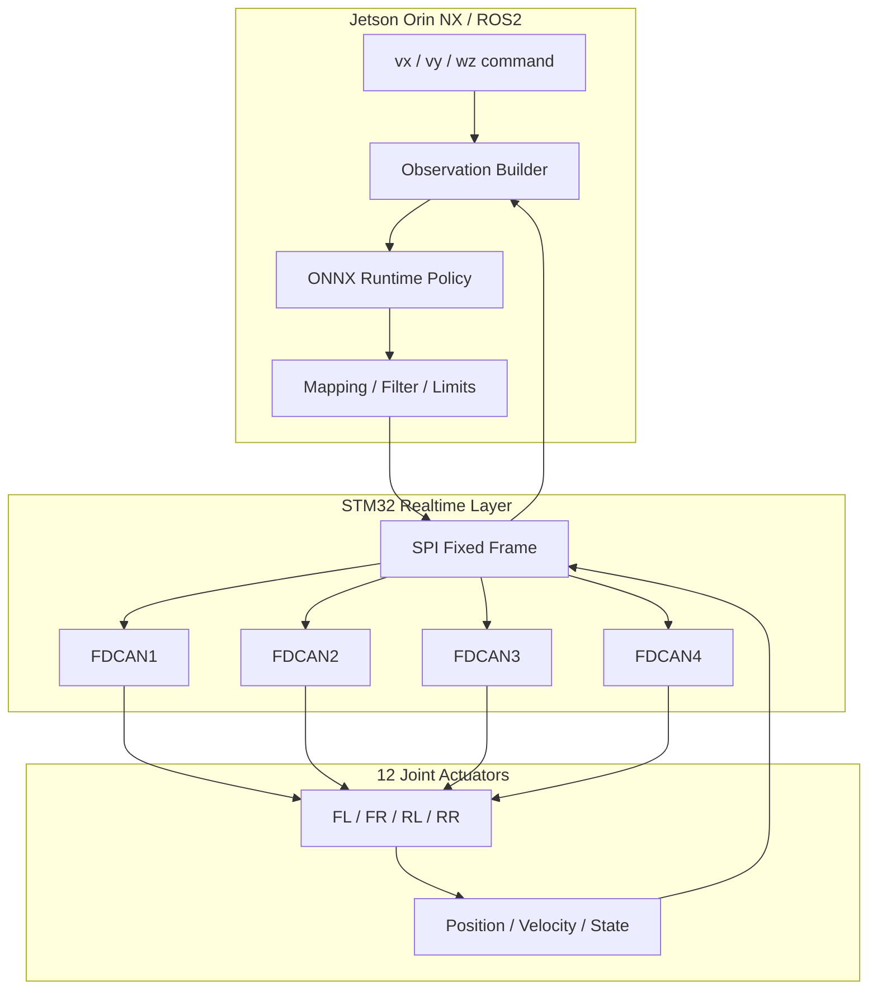

设计原则是：**上层策略推理与下位实时通信解耦**。高层可以继续增加导航或智能任务模块，但电机实时闭环仍由确定性链路负责。

---

## 5. 强化学习与部署链路

### 5.1 训练框架

当前训练主线基于：

- NVIDIA Isaac Gym
- Legged Gym
- RSL-RL
- PPO
- 自定义 `fanfan` / `fanfan_omni_*` 任务与配置

仓库 `unitree_rl_gym/legged_gym/envs/__init__.py` 中注册了大量围绕 RS01 与 Fanfan 平台迭代的任务，包括直行、全向运动、接触协调、偏航抑制、力矩约束、对称性、真实数据课程学习等实验分支。

### 5.2 Observation / Action

当前选定策略的 Deployment Contract 中：

- **Observation**：52 维
- **Action**：12 维
- **Policy 频率**：`sim_dt = 0.005`，`decimation = 4`，即约 **50 Hz**

Observation 主要包含：

```text
base linear velocity
base angular velocity
projected gravity
commands [vx, vy, wz]
dof position error
dof velocity
previous actions
gait phase sin/cos
heading error sin/cos
```

Action 对应 12 个关节目标，当前策略顺序为：

```text
FL_hip   FL_thigh   FL_calf
FR_hip   FR_thigh   FR_calf
RL_hip   RL_thigh   RL_calf
RR_hip   RR_thigh   RR_calf
```

### 5.3 关节语义映射

<p align="center">
  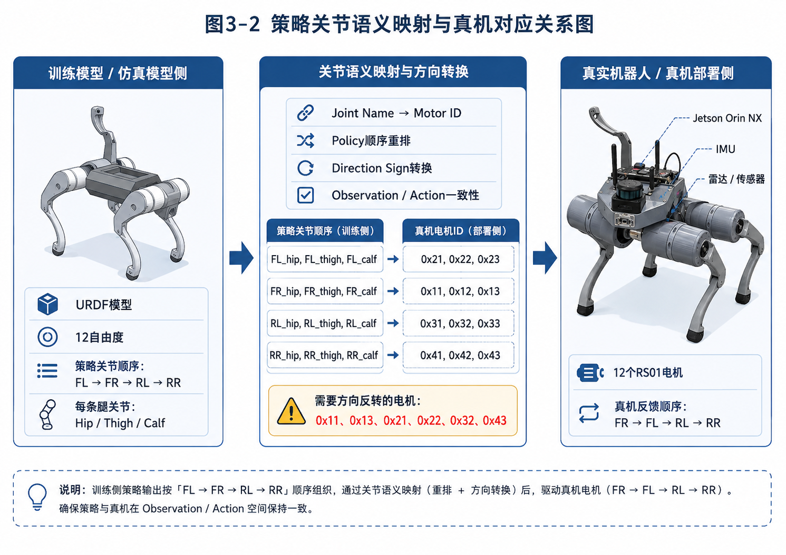
</p>

Sim2Real 中最容易被低估的问题之一，是以下几项必须完全一致：

1. 策略输出的 12 关节顺序；
2. URDF 中的关节语义；
3. 真机电机 ID；
4. 关节正负方向；
5. 机械零位；
6. 默认站立角；
7. Kp / Kd 与动作缩放。

任意一项错位，都可能表现为“仿真正常、真机异常”。因此本项目把 **joint mapping + Deployment Contract** 作为部署链路的一部分，而不是最后临时手工对齐。

---

## 6. 当前选定策略模型

仓库根目录 `SELECTED_MODEL_5530.md` 当前记录的统一模型为：

| 项目 | 当前值 |
|---|---|
| Task | `fanfan_omni_symmetric_transition` |
| Run | `Jul14_11-59-33_symmetric_transition_from_force_coord_5280` |
| Checkpoint | `5530` |
| PT | `mujoko/models/fanfan_symmetric_transition_5530.pt` |
| ONNX | `mujoko/models/fanfan_symmetric_transition_5530.onnx` |
| Observation / Action | `52 / 12` |
| Policy rate | `50 Hz` |

当前模型的部署参数由同名 JSON 保存：

```text
mujoko/models/fanfan_symmetric_transition_5530.json
```

其中包含：

- joint order
- default joint angles
- initial base pose
- sim dt / decimation
- stiffness / damping
- action scale
- torque limits
- observation layout / scale
- command range
- gait phase / phase offset

当前 JSON 中的策略保护力矩限制为：

```text
hip   : 10 N·m
thigh : 10 N·m
calf  : 13 N·m
```

这比 RS01 电机硬件峰值能力更保守，目的是给真机调试保留安全余量。

> `mujoko/README.md` 中还保留了更早阶段的模型与实验记录；当前正式选型请优先参考根目录 `SELECTED_MODEL_5530.md` 与对应 JSON。

---

## 7. 仓库结构

```text
gym_dog/
├── README.md
├── SELECTED_MODEL_5530.md
├── 11.md
│
├── unitree_rl_gym/
│   ├── legged_gym/
│   │   ├── envs/                  # Fanfan / RS01 / Omni 等训练任务
│   │   └── scripts/               # train / play / evaluate / export
│   └── doc/                       # 上游安装与使用文档
│
├── rsl_rl/                        # PPO / RL 算法库
├── fanfan_urdf/                   # 自研机器人 URDF、mesh、ROS package
│
├── mujoko/
│   ├── sim2sim.py                 # 主 Sim2Sim 入口
│   ├── export_onnx.py             # ONNX + Deployment Contract 导出
│   ├── prepare_model.py           # MuJoCo scene / model 准备
│   ├── evaluate_policy_matrix.py  # 多工况评估
│   ├── evaluate_recovery_matrix.py
│   ├── models/                    # PT / ONNX / JSON 模型与合同
│   └── logs/                      # Sim2Sim 日志
│
├── zhenji/                        # 真机 ROS2 workspace / 部署代码
├── artifacts/                     # Sim2Sim 结果与实验产物
└── tools/                         # 辅助工具
```

其中：

- `11.md`：保存真实实验数据分析和问题定位记录，例如步态周期摆头、横向速度振荡、接触占空比不对称、力矩饱和等；
- `SELECTED_MODEL_5530.md`：当前选定策略及训练 / Gym / MuJoCo / 真机入口说明；
- `mujoko/models/*.json`：部署合同，建议与对应 ONNX 一同归档。

---

## 8. 环境配置

### 8.1 推荐环境

项目实际研发以 Linux + NVIDIA GPU 为主。当前项目常用环境包括：

| 模块 | 环境 |
|---|---|
| 训练主机 | Ubuntu 22.04 + NVIDIA GPU |
| 强化学习 | Isaac Gym / Legged Gym / RSL-RL |
| Python | 3.8 为主 |
| 真机上位机 | Jetson Orin NX SUPER 8GB |
| Jetson OS | Ubuntu 22.04 |
| ROS | ROS2 Humble |
| 推理 | ONNX Runtime |
| Sim2Sim | MuJoCo |

### 8.2 Isaac Gym 环境

仓库上游安装文档位于：

```text
unitree_rl_gym/doc/setup_zh.md
```

参考步骤：

```bash
conda create -n unitree-rl python=3.8
conda activate unitree-rl
```

仓库内上游文档当前给出的 PyTorch 安装示例为：

```bash
conda install pytorch==2.3.1 torchvision==0.18.1 torchaudio==2.3.1 \
  pytorch-cuda=12.1 -c pytorch -c nvidia
```

然后安装 Isaac Gym：

```bash
cd /path/to/isaacgym/python
pip install -e .
```

安装本仓库内的 RSL-RL 与训练环境：

```bash
cd /path/to/gym_dog/rsl_rl
pip install -e .

cd /path/to/gym_dog/unitree_rl_gym
pip install -e .
```

> **兼容性提示**：Isaac Gym Preview 4 对 NVIDIA 驱动、CUDA、PyTorch 和 Python 版本较敏感。若要复现实验，建议优先使用已经验证可运行的项目环境，不要在可运行环境上直接进行大版本升级。

### 8.3 MuJoCo 环境

`mujoko/requirements.txt` 当前依赖：

```text
numpy==1.24.4
mujoco==3.2.3
onnx==1.16.2
onnxruntime==1.19.2
pillow==12.2.0
```

建议使用独立虚拟环境：

```bash
cd /path/to/gym_dog/mujoko
python3 -m venv .venv
source .venv/bin/activate
pip install -r requirements.txt
```

---

## 9. 快速开始

### 9.1 克隆仓库

```bash
git clone https://github.com/jujjjk/gym_dog.git
cd gym_dog
```

如果后续使用到仓库中的 gitlink / 外部子项目，请根据实际配置同步对应内容。

### 9.2 训练

通用入口：

```bash
cd unitree_rl_gym
python legged_gym/scripts/train.py --task <task_name>
```

例如当前选定策略对应任务：

```bash
python legged_gym/scripts/train.py \
  --task fanfan_omni_symmetric_transition \
  --sim_device cuda:0 \
  --rl_device cuda:0
```

> 当前 `fanfan_omni_symmetric_transition` 配置与 5530 续训链相关。如果是全新环境、没有原始 `logs/` checkpoint，请先检查配置中的 `resume / load_run / checkpoint`，不要直接把“续训配置”当作从零训练配置使用。

### 9.3 Gym Play

当前选定模型的项目命令为：

```bash
cd unitree_rl_gym

FANFAN_PLAY_TRANSITIONS=1 \
python legged_gym/scripts/play_omni.py \
  --task fanfan_omni_symmetric_transition \
  --load_run Jul14_11-59-33_symmetric_transition_from_force_coord_5280 \
  --checkpoint 5530 \
  --num_envs 18
```

如果本地没有对应训练日志，可以优先使用仓库已导出的 ONNX 在 MuJoCo 中验证。

---

## 10. MuJoCo Sim2Sim

MuJoCo 用于回答一个关键问题：

> **策略是否只在 Isaac Gym 中表现正常，还是能在第二个动力学引擎中保持基本运动行为？**

当前 5530 模型验证示例：

```bash
cd /path/to/gym_dog
source mujoko/.venv/bin/activate

python mujoko/sim2sim.py \
  --policy mujoko/models/fanfan_symmetric_transition_5530.onnx \
  --viewer \
  --demo-matrix \
  --duration 120 \
  --segment-duration 8
```

也可以做短时验证：

```bash
python mujoko/sim2sim.py \
  --policy mujoko/models/fanfan_symmetric_transition_5530.onnx \
  --viewer \
  --duration 20
```

项目原则是：**MuJoCo 不额外添加“为了让结果看起来更好”的航向控制器去掩盖策略问题**。如果跨引擎出现漂移、接触异常或力矩问题，应优先回到训练参数、执行器建模和域随机化中定位原因。

---

## 11. ONNX 与 Deployment Contract

本项目不建议“只导出一个 ONNX 然后手动猜参数”。

`mujoko/export_onnx.py` 的目标是同时导出：

```text
policy.onnx
policy.json
```

其中 JSON 相当于策略的 **Deployment Contract**，用于固定训练与部署之间必须一致的参数。

### 为什么需要 Deployment Contract？

同一个神经网络，如果以下任一项不一致，都可能出现严重 Sim2Real 偏差：

- observation 顺序；
- observation scale；
- joint order；
- default joint angle；
- action scale；
- Kp / Kd；
- torque limit；
- control dt / decimation；
- gait phase；
- command range；
- output transform。

因此建议模型归档时始终保持：

```text
model_XXXX.pt
model_XXXX.onnx
model_XXXX.json
```

三者一一对应。

---

## 12. 真机部署

### 12.1 真机硬件链路

当前平台：

```text
Jetson Orin NX
    │
    ├── ROS2 / ONNX Runtime / Policy
    │
   SPI
    │
┌───┴─────────────┐
│                 │
STM32 A         STM32 B
│                 │
CAN × 2         CAN × 2
│                 │
FR + FL         RL + RR
│                 │
└────── 12 × RS01 ┘
```

底层通信、RS01 报文与电机控制相关内容可继续参考：

https://github.com/jujjjk/zhenji_dog

### 12.2 真机部署顺序

**不建议训练完直接落地行走。** 当前项目采用逐级放开的方式：

```text
1. Deployment Contract 校核
        ↓
2. ONNX dry-run（不发电机）
        ↓
3. 关节顺序 / 方向 / 零位检查
        ↓
4. 悬挂 / 系留测试
        ↓
5. stand-only
        ↓
6. 低速短程前进
        ↓
7. 横移 / 转向
        ↓
8. 全向与连续任务
```

### 12.3 真机安全

至少保留以下保护：

- 急停；
- 机械悬挂 / 系留；
- 关节位置限位；
- action rate limit；
- action acceleration limit；
- torque limit；
- 通信超时停机；
- 姿态异常保护；
- 零命令 gate；
- 上电 / 站立 / 行走分阶段状态机。

> 真机测试具有机械伤害和大电流风险。任何高增益、高力矩测试都应先在悬挂或安全空间完成。

---

## 13. Sim2Real 关键问题

当前项目的价值不仅在于“训练出了一个会走的模型”，也在于积累了大量仿真到真机失败后的问题定位记录。

### 13.1 当前重点问题

- 前腿拖地；
- 左右横摆；
- 步态不对称；
- 启动偏航；
- 长距离横漂；
- 接触时序不均衡；
- PD 原始力矩请求过大、实际被力矩限制截断；
- 仿真与真实执行器响应存在差异；
- 估计量和真实传感器量不完全一致。

### 13.2 数据驱动 Debug

仓库根目录 `11.md` 保存了一个典型真机/仿真日志分析案例，其中定位到：

- 约 2 Hz 的步态同步摆头与横向速度周期振荡；
- 对角组接触占空比差异；
- 对角组垂直支撑力交接不对称；
- 大腿 / 小腿力矩请求出现明显饱和；
- 某些“纠偏模型”在初始化阶段实际上仍等价于基础策略。

这类记录的目标是把“机器人走歪了”转化成可测量问题：

```text
现象
 ↓
CSV / TensorBoard / MuJoCo / 真机日志
 ↓
速度 / 姿态 / 接触 / 力矩 / 关节动作统计
 ↓
定位训练或部署环节
 ↓
重新训练 / 参数修正 / 保护策略
 ↓
再次 Sim2Sim / Sim2Real 验证
```

---

## 14. 项目视频

### Sim2Sim 全向运动效果

▶ **[点击观看 Sim2Sim 演示视频](./fe204b258b949d205d11b0cb348f7e79.mp4)**

[下载原始 MP4（约 6.4 MB）](https://raw.githubusercontent.com/jujjjk/gym_dog/fix/rs01-heading-odom-soft-inhibit/fe204b258b949d205d11b0cb348f7e79.mp4)

用户提供的仿真效果录像，用于展示运动效果，不作为真实机器人部署安全性证明。

### 本轮 RS01 验证进展（2026-09-09）

本轮基线为 **A 组 seed16 的 `model_6850.pt`＋站立相位冻结**；与前文记录的历史选型 `model_5530.pt` 区分，不表示真机选型已更新。

- 修复 MuJoCo 桥接中关节状态与机身角速度的采样时序不一致；保留真实 RS01 执行器模型、原策略和原腿里程计，无需为该修复重训。
- 修复后 MuJoCo：12 个指令 × 4 个初始相位，每例 30 秒，**48/48 完成**。
- 每 5 秒切换动作的 55 秒序列：PhysX 与 MuJoCo **均 4/4 完成**。该已测序列包含站立，不等同于后来提供的全程踏步衔接序列。
- 尚未通过整个速度域与 Sim2Real 验收：PhysX 的 0.6 m/s 前进测试仍有失稳，方向精度、机身起伏和足端内收仍需改善。

详见 [传感器时序修复、量化结果与复现命令](unitree_rl_gym/RS01_SENSOR_SYNC_FINDINGS.md)。

相关入口：

- [MuJoCo 修正版播放器](mujoko/rs01_go2/sim2sim_sensor_sync.py)
- [MuJoCo 固定动作与切换测试](mujoko/rs01_go2/evaluate_v15.py)（修正版使用 `--sensor-sync`）
- [PhysX 动作切换测试](unitree_rl_gym/legged_gym/scripts/check_rs01_sensor_sync_transitions.py)
- [弹跳、足端间距与里程计诊断](mujoko/rs01_go2/diagnose_support_motion.py)

其他实机、联调与训练录像可继续补充；未提供的视频不使用占位链接冒充演示。

---

## 15. 下一阶段路线

### 15.1 运动底座

当前 RS01 平台继续承担智能控制软件验证；下一代机型计划围绕 RS03 重新设计机械、电源、URDF 与强化学习参数。

<p align="center">
  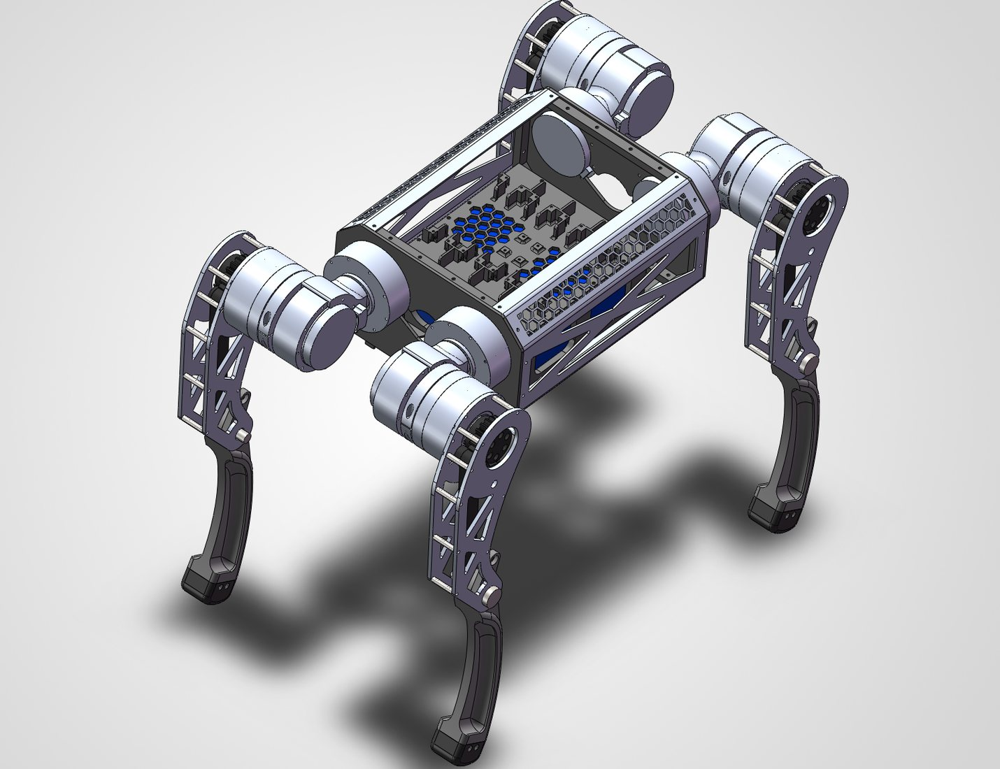
</p>

> RS03 属于后续平台升级计划，并非当前仓库已经完成的硬件状态。

### 15.2 智能控制

后续目标不是让 LLM 直接输出 12 关节动作，而是保持任务层、空间层和运动层解耦：

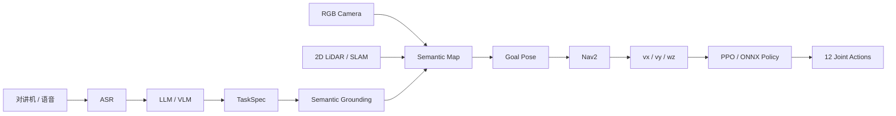

计划分阶段验证：

1. **已知目标导航**：语义标签 → map 坐标 → Nav2 → RL；
2. **未知目标搜索**：Frontier + 视觉语义评分；
3. **空间关系**：`near / left of / between` 等关系目标；
4. **多步任务**：Search / Navigate / Observe / Return；
5. **复杂地形**：把台阶 / 楼梯运动能力作为可调用运动技能。

### 15.3 路线原则

- LLM / VLM 事件触发、低频运行；
- Nav2 中频规划；
- PPO 固定约 50 Hz 实时执行；
- 高层模型不能绕过 TaskSpec、导航安全区和关节保护；
- 所有未来模块优先以 ROS2 独立节点方式接入，保持可测试、可替换、可回滚。

---

## 16. 相关仓库与致谢

### 本项目相关

- 运动控制 / 训练 / Sim2Sim：[jujjjk/gym_dog](https://github.com/jujjjk/gym_dog)
- 真机底层通信与 RS01 驱动：[jujjjk/zhenji_dog](https://github.com/jujjjk/zhenji_dog)

### 主要上游项目

本项目在研发过程中参考、使用或基于以下开源项目：

- Unitree RL Gym — https://github.com/unitreerobotics/unitree_rl_gym
- Legged Gym — https://github.com/leggedrobotics/legged_gym
- RSL-RL — https://github.com/leggedrobotics/rsl_rl
- MuJoCo — https://github.com/google-deepmind/mujoco
- ROS2 — https://docs.ros.org/

感谢相关开源项目与社区提供的基础代码与研究工具。

---

## Maintainer

**邢翻翻** · GitHub: [@jujjjk](https://github.com/jujjjk)

如果你正在复现这个项目、研究四足机器人 Sim2Real，或者对当前 RS01 / RS03、ROS2、MuJoCo 与强化学习部署路线感兴趣，欢迎通过 GitHub Issue 交流。
